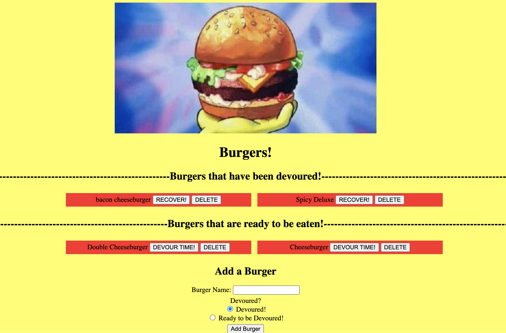

# Eat A Burger


## Description

This app allows you to submit a burger and then devour it. You can also delete it and recover the burger. 

deploy app here: https://still-cliffs-71059.herokuapp.com/

Screenshot:


## Table of Contents 

* [Installation](#installation)

* [Usage](#usage)

* [License](#license)

* [Contributing](#contributing)

* [Tests](#tests)

* [Questions](#questions)

## Installation

To install necessary dependencies, run the following command:

```
npm i
```

## Usage

Nothing free to use; have fun :)

## License

This project is licensed under the APACHE 2.0 license.
  
## Contributing

N/A

## Questions

If you have any questions about the repo, open an issue or contact me directly at mariohernandezk10@gmail.com. You can find more of my work at [MarioHernandez](https://github.com/mariohernandezk10).

